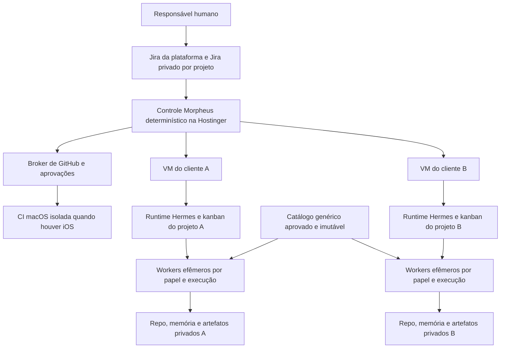

# Arquitetura proposta e fronteira com Hermes

## O que foi verificado

O snapshot pesquisado do Hermes é `8e85b276f1dba5a92f74125127f5dc7841bf24a8`. A API nativa de plugins oferece `plugin.yaml`, `register(ctx)`, ferramentas, hooks, comandos CLI, skills e integração com provedores de memória. Há ativação explícita em `plugins.enabled`. O contrato documentado favorece compatibilidade aditiva, mas **imports internos não recebem a mesma garantia**. Ver [guia de plugins](https://github.com/NousResearch/hermes-agent/blob/8e85b276f1dba5a92f74125127f5dc7841bf24a8/website/docs/developer-guide/plugins/index.md).

Há também kanban persistente com boards, perfis, dependências, claims, retomada, worktrees e contratos de conclusão de PR. Isso reduz o trabalho de coordenação local. O próprio código/documentação assume um operador local confiável: não devemos converter labels de tenant ou seleção de board em garantia contra execução arbitrária. Ver [kanban pesquisado](https://github.com/NousResearch/hermes-agent/blob/8e85b276f1dba5a92f74125127f5dc7841bf24a8/website/docs/user-guide/features/kanban.md).

## Estrutura no fork

```text
<fork-hermes>/
  [arquivos upstream preservados]
  extensions/morpheus-company/
    pyproject.toml
    plugin.yaml
    src/morpheus_company/
      domain/                 # regras e contratos sem imports do Hermes
      application/            # casos de uso e políticas de transição
      adapters/hermes/        # único limite de integração com Hermes
      adapters/jira/
      adapters/github/
      adapters/runners/       # Hermes, Codex, Claude
      adapters/storage/
    profiles/                 # personas genéricas versionadas
    skills/                   # pacote curado, versões fixadas
    tests/                    # contratos e cenários de negócio
  deploy/morpheus/             # imagens, provisionamento e runbooks genéricos
  docs/morpheus-plan/          # este plano
  .github/workflows/morpheus-*.yml
```

Layout **proposto**, a validar no spike R0. O pacote tem dependências opcionais próprias. Instalação distribui o plugin no diretório de plugins de um Hermes home controlado ou via entry point suportado. Não depende da descoberta de plugins no diretório de um cliente, nem de `HERMES_ENABLE_PROJECT_PLUGINS`. Pode ser extraído futuramente para repo privado sem reescrever o domínio.

## Ativação e desligamento

O operador instala e habilita `morpheus-company` usando o mecanismo nativo do Hermes. O plugin registra ferramentas `company_*`, comandos e skills namespaced. Não substitui ferramentas core nem modifica classes com monkey patches. Um serviço determinístico de controle acompanha o plugin quando habilitado; jobs não devem depender de uma conversa viva.

O toggle nativo controla o carregamento; uma configuração Morpheus controla capacidades internas. O [exemplo de configuração](contracts/company-config.example.json) descreve o contrato pretendido, não uma configuração Hermes diretamente utilizável.

Desabilitar implica: pausar novas claims → drenar/cancelar jobs conforme política → persistir checkpoints → revogar concessões de execução → desabilitar plugin → reiniciar processos. Não apaga dados. Testes com módulo ausente e desabilitado comprovam ausência de alterações no comportamento normal do Hermes. Um worker de cliente **não pode usar desligamento do plugin como saída para executar Hermes sem política**: seu supervisor encerra a sessão se o componente obrigatório estiver ausente.

## Topologia



O controle contém IDs opacos, orçamento, política, fila e ponteiros autorizados. Não encaminha escopos de vários clientes a um mesmo LLM. Um PM de portfólio pode trabalhar com métricas agregadas autorizadas, mas não tem memória global de projetos. PM/PO/TM/TL com contexto de negócio são instâncias vinculadas ao projeto.

## Componentes e decisões de construir/reutilizar

| Componente | Escolha inicial | Fronteira |
|---|---|---|
| Loop de agente, providers, terminal e skills | Hermes | Adapter testa comportamento das APIs usadas |
| Fila de trabalho dentro do projeto | Kanban Hermes, se spike passar | Um ambiente/board por projeto; não compartilhar DB com clientes |
| Estado de negócio, autorizações e orçamento | Morpheus | Banco transacional do controle; sem prompts de clientes |
| Claim de execução | Autoridade única por tarefa | Se kanban executa, Morpheus não cria claim concorrente independente |
| Persona e especialização | Perfil genérico + binding por execução | Sem memória privada no template |
| Policy broker | Morpheus determinístico | Identidade vinculada fora do prompt; nega por padrão |
| GitHub/Jira | Adapters | Credenciais curtas e escopo por repo/projeto |
| Memória compartilhada | Catálogo sanitizado separado | Read-only nos workers |
| Telemetria | Eventos estruturados | Conteúdo privado retido apenas no ambiente correspondente |

Morpheus não substitui o banco interno de sessões do Hermes. Um pequeno PostgreSQL no controle é a proposta para outbox, grants e orçamento; kanban/sessões permanecem locais. Antes de introduzir um segundo motor de filas, R0 deve provar o adapter usando CLI documentada ou superfície pública. Se for necessário importar módulos internos, registrar uma exceção e teste de contrato, ou usar fila Morpheus com **dispatcher Hermes desabilitado**. Nunca dois dispatchers para a mesma tarefa.

## Contratos de domínio

| Entidade | Dados essenciais | Invariante |
|---|---|---|
| ProjectBinding | tenant, projeto, repo, Jira, ambiente, classification | Provisionado por autoridade; não pelo LLM |
| WorkItem | ID estável, spec revision, aceite, blockers, papel, budget | Ready requer Definition of Ready verificável |
| Execution | run ID, attempt, lease/fence, base SHA, prompt/skill lock | Um proprietário ativo; retry mantém identidade do trabalho |
| Handoff | saída tipada, referências, lacunas, próximo papel | Só referências do projeto ou catálogo aprovado |
| Approval | ator, ação, objeto, SHA/hash, prazo, decisão | Alteração de objeto invalida aprovação |
| Evidence | comando/check, conclusão, SHA, URI, digest | Resultado textual do LLM sozinho não fecha ticket |
| KnowledgeCandidate | origem privada, licença, sanitização, avaliações | Não entra no catálogo até promoção autorizada |

Interfaces propostas: `submit_work`, `claim_work`, `record_checkpoint`, `request_decision`, `record_evidence`, `reconcile_publication`, `promote_knowledge`. Não são APIs existentes do Hermes. Os schemas em `contracts/` são contratos para implementação e revisão.

## Comunicação entre agentes

Papéis produzem artefatos versionados em vez de conversas infinitas. O PO entrega critérios de aceite; TL entrega decisões e limites; engenheiro entrega diff e evidência; QA/revisor entrega achados; PO valida resultado; humano autoriza o que a política reservou. Revisores usam contextos novos e o mesmo SHA de mudança. Mudança de SHA invalida revisão anterior quando afeta seu escopo.

`delegate_task` é útil para subtarefas curtas **dentro do mesmo projeto**. Não é a fronteira de isolamento entre clientes: filhos herdam ferramentas e podem operar no mesmo ambiente. Trabalhos longos e que aguardam humanos passam pela fila persistente.

## Contrato de compatibilidade

Fixar Hermes SHA + versão do módulo + lock das skills + imagem de runtime. R0 testa carregamento/registro, habilitar/desabilitar, perfil isolado, tool denial, memória, conclusão de tarefa e recuperação. Manter teste com baseline suportado e candidato upstream. No snapshot há aviso de migração de imports internos em setembro de 2026: reforça a opção por APIs documentadas; não codificar um workaround para import obsoleto.
